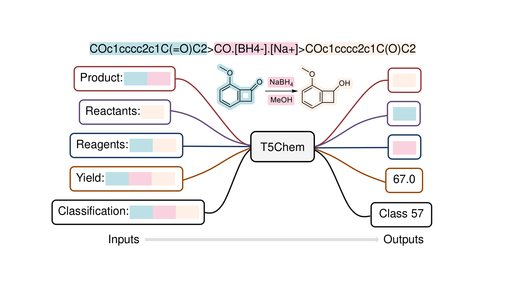

T5Chem
======

.. image:: https://img.shields.io/pypi/v/t5chem.svg
    :target: https://pypi.python.org/pypi/t5chem
    :alt: Latest PyPI version

A Unified Deep Learning Model for Multi-task Reaction Predictions.

It is built on `huggingface transformers`_ -- T5 model with some modifications.

.. _huggingface transformers: https://github.com/huggingface/transformers

Installation
------------

T5Chem can be either installed via pip or from source. We recommend to install t5chem from source.

1. To install from source (with latest version):

 .. code:: bash

   $ git clone https://github.com/HelloJocelynLu/t5chem.git
   $ cd t5chem/
   $ python setup.py install
   $ python setup.py test # optional, only works when you have pytest installed

It should automatically handle dependencies for you.

2. To install via pip

 .. code:: bash

   $ pip install t5chem

Usage
-----
Call from command line:

.. code:: bash

   $ t5chem -h # show the general help information
   $ t5chem train -h # show help information for model training
   $ t5chem predict -h # show help information for model prediction

We have some sample data (a small subset from datasets used in paper) available in `data/` folder, to have a quick start:

.. code:: bash

   $ tar -xjvf data/sample_data.tar.bz2
   $ t5chem train --data_dir data/sample/product/ --output_dir model/ --task_type product --pretrain models/pretrain/simple/ --num_epoch 30
   $ t5chem predict --data_dir data/sample/product/ --model_dir model/

Note that we may not get a very good result (~70% top-1 accuracy) as we are only trained on a small dataset.

Required auguments:

- `data_dir`: The path to data directory, should contain `train.source`, `train.target` for training, and `test.source`, `test.target` for testing
- `output_dir`: The directory to save trained model. Will generate four files: `vocab.pt` for vocabulary, `config.json` for model configuration, `pytorch_model.bin` for trained model weights and `training_args.bin` for training arguments.
- `task_type`: task type. Currently we are supporting `product` (for forward reaction prediction), `reactants` (for single-step retrosynthesis), `reagents` (for reagents prediction), `regression` (to predict numeric values) and `classification` (to predict categorical values).
- `model_dir`: The path to a trained model. (task type, tokenization method...etc can be inferred from saved model.

Call as an API:

.. code:: python

   from transformers import T5ForConditionalGeneration
   from t5chem import T5ForProperty, SimpleTokenizer
   pretrain_path = "path/to/your/pretrained/model/"
   model = T5ForConditionalGeneration.from_pretrained(pretrain_path)    # for seq2seq tasks
   tokenizer = SimpleTokenizer(vocab_file=os.path.join(pretrain_path, 'vocab.pt'))
   inputs = tokenizer.encode("Product:COC(=O)c1cc(COc2ccc(-c3ccccc3OC)cc2)c(C)o1.C1CCOC1>>", return_tensors='pt')
   output = model.generate(input_ids=inputs, max_length=300, early_stopping=True)
   tokenizer.decode(output[0], skip_special_tokens=True) # "COc1ccccc1-c1ccc(OCc2cc(C(=O)O)oc2C)cc1"

   model = T5ForProperty.from_pretrained(pretrain_path)  # for non-seq2seq task
   inputs = tokenizer.encode("Classification:COC(=O)c1cccc(C(=O)OC)c1>CN(C)N.Cl.O>COC(=O)c1cccc(C(=O)O)c1", return_tensors='pt')
   outputs = model(inputs)
   print(outputs.logits.argmax())   # Class 3

We have Google Colab examples available! Feel free to try it out:

- Call T5Chem via CLI (command line) `Colab <https://colab.research.google.com/drive/13tJlJ5loLtws6u91shbSjuPoiA1fCSae?usp=sharing>`__

- Use a pretrained model in python script `Colab <https://colab.research.google.com/drive/1xwz7c7q1SwwD5jEQKamo9TNCN1PKH8um?usp=sharing>`__

- Design your own project: predict molecular weights `Colab <https://colab.research.google.com/drive/1eu22gjGJDwXy59TBL8pfDmBF5_DQXBGn?usp=sharing>`__

Compatibility
-------------
- Now we have found some installation issues on rdkit version later than 2020.09.2 (See discussion `here <https://stackoverflow.com/questions/65487584/how-to-import-rdkit-in-google-colab-these-days>`_)

- torchtext version 0.10.0 published some backward incompatible changes. T5Chem now only tested on torchtext<=0.8.1 

Licence
-------
MIT Licence.

Authors
-------

`t5chem` was written by `Jocelyn Lu <jl8570@nyu.edu>`_.
